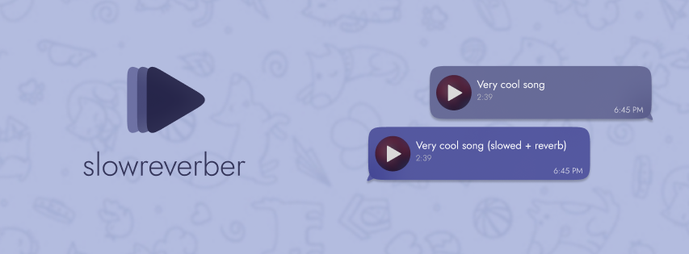
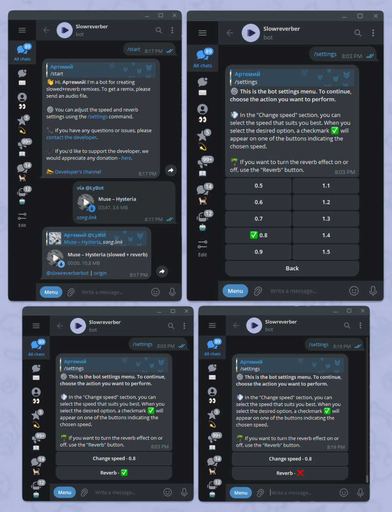

# 📻 slowreverber

[](https://telegram.org/) 
[](https://nodejs.org/)
[](https://www.typescriptlang.org/)
[](https://www.mysql.com/)

**Telegram bot for creating slowed/speed up+reverb remixes.**



## 🚀 Running
1. Copy `example.env` to `.env` and fill it with your data.
2. Install dependencies:
```bash
npm install
```
3. Install ffmpeg and sox:
```bash
sudo apt install ffmpeg sox
```
4. Install and configure [mysql](https://dev.mysql.com/doc/mysql-installation-excerpt/5.7/en/) and [redis](https://redis.io/docs/install/install-redis/).
3. Start:
```bash
npm run bot
```

## ⚒ Configuring
- `BOT_TOKEN` Telegram bot token
- `log` Options: debug / info
- `DB_HOST` Your db hostname or ip
- `DB_HOST` Your db port
- `DB_NAME` Your db name
- `DB_USERNAME` Your db username
- `DB_PASSWORD` Your db user password
- `REDIS_PORT` Your redis port
- `REDIS_HOST` Your redis hostname or ip
- `REDIS_PASS` Your redis password

## 📄 Commands
- `start` - start command ¯\\\_(ツ)\_\/¯
- `settings` - show settings menu

## 📸 Screenshots
